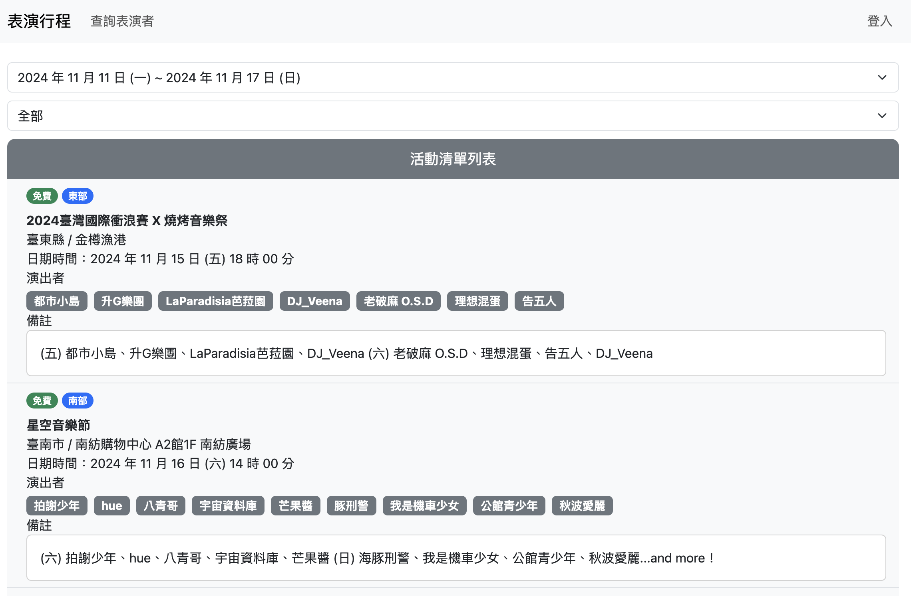
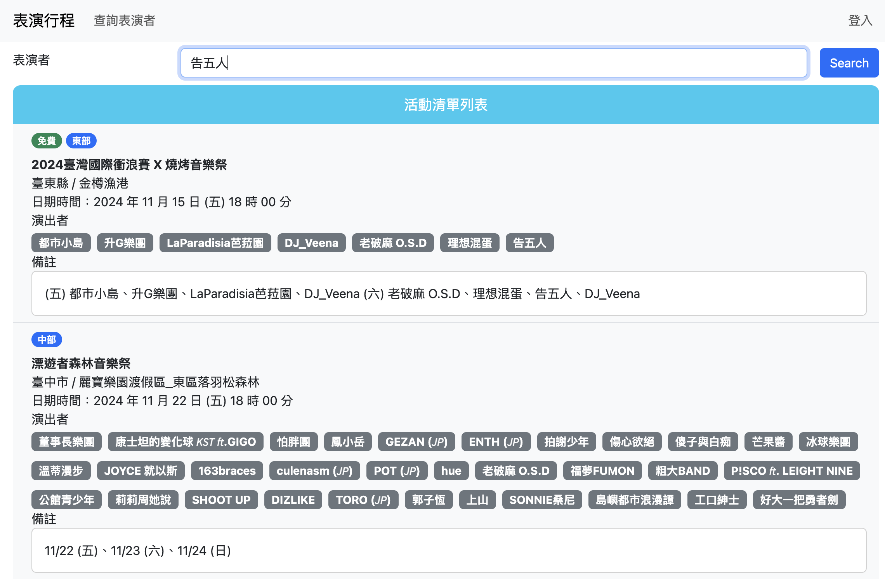
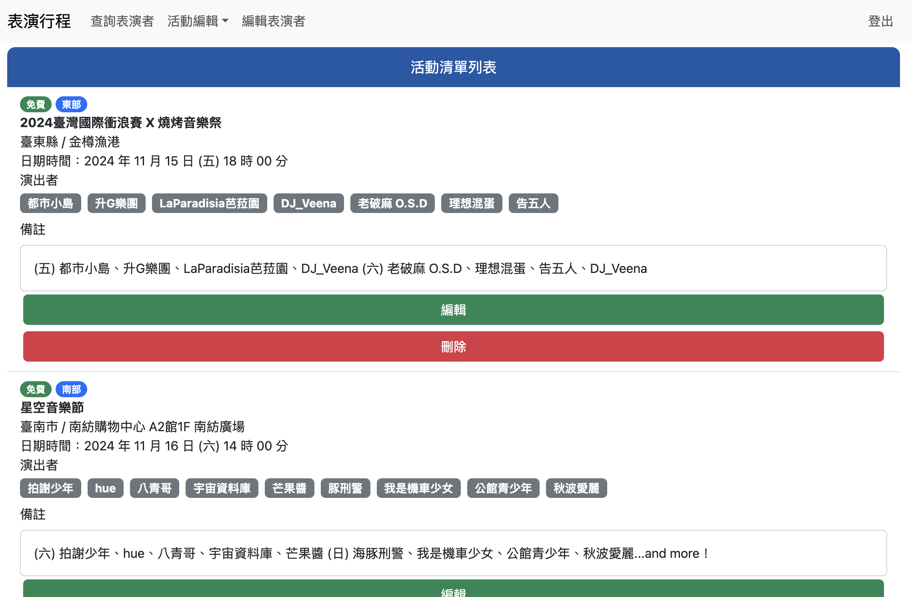

# Band Performance Information Website

Demo website : [Band Performance Website](https://frontend-57588337508.asia-east1.run.app/)

Introduction
---
Every week, numerous band performances take place across Taiwan, but information about these events is often hard to access for general audiences. This project was inspired by [2024 全台演出行事曆](https://docs.google.com/spreadsheets/d/12e1KYIkUGtirrglU8TQ4weEl8xD3RNNJjkSeXQjKFfM/edit?gid=2013607114#gid=2013607114), a community-shared document that collect band performance schedules. This web application aims to make it easier for audiences to find up-to-date performance information by providing an accessible, organized platform.

This band performance website is developed with:
- Backend: `Golang`
- Frontend: `ReactJS`
- Database: `MySQL`
- Deployment: `Google Cloud Run`

🔎 Preview
---
Home Page: Display weekly performances  

Query Performer: Show upcoming performances for the selected performer  

Administrator Page: Event editing interface  

🌟 Features
---
✅ Google account login for authentication  
✅ Performer-based event search  
✅ Region-based event view  
✅ Weekly performance overview  
✅ Authorized account access for event editing  

This project structure is based on this [github repo](https://github.com/Coding-with-Robby/go-with-react).
